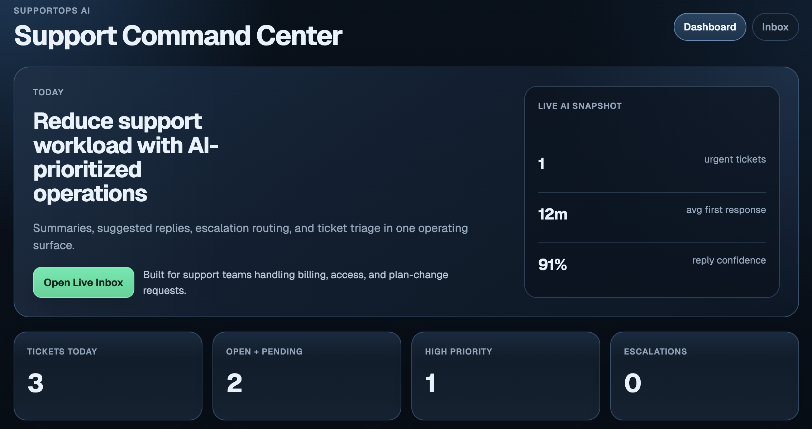
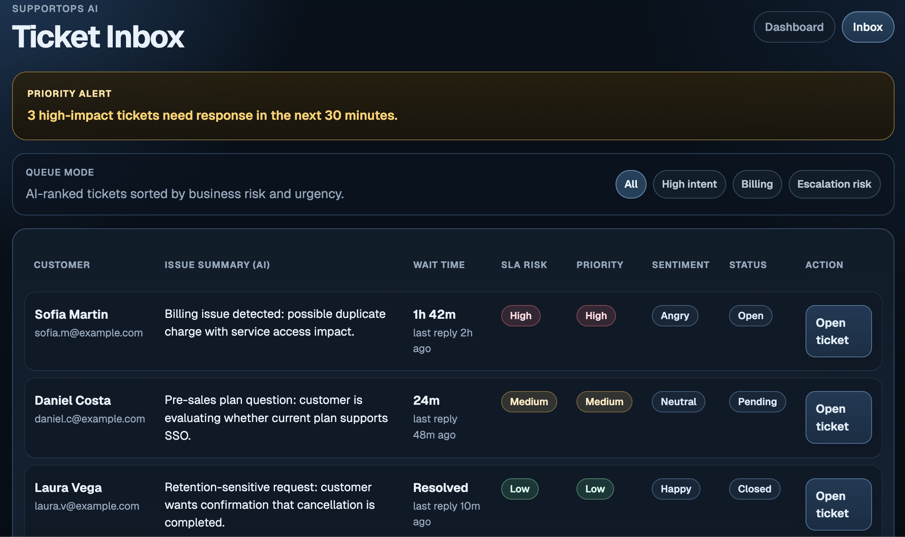
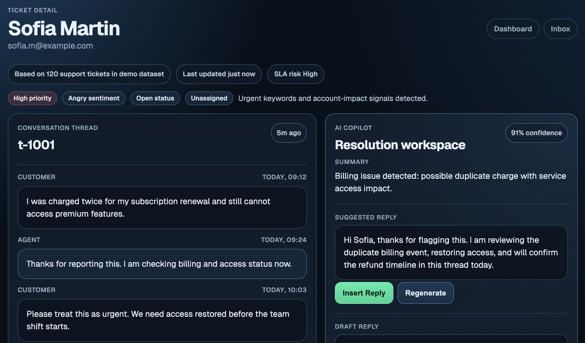

# SupportOps AI

AI-powered copilot for customer support teams.

SupportOps AI helps support teams prioritize tickets, generate suggested replies, surface policy references, and reduce handling time across billing, access, and plan-change workflows.

## Live Links

- Live Demo: https://supportops-ai-phi.vercel.app
- GitHub: https://github.com/iveteamorim/supportops-ai

## Overview

SupportOps AI is a support operations workspace designed for teams handling high-volume customer issues. It combines ticket triage, AI summaries, suggested replies, escalation workflows, and policy context in a single interface.

## Business Impact

Designed to:

- Reduce support handling time by 50-70%
- Improve response consistency across agents
- Help teams resolve urgent tickets faster
- Reduce operational load on repetitive support work

## What Makes This Different

Most support tools focus on managing tickets.

SupportOps AI focuses on decision-making under pressure:

- prioritizing based on business risk, not just queue order
- surfacing urgency through SLA and wait-time signals
- augmenting agents with contextual AI, not replacing them

This project is designed as an operational layer, not just a support interface.

## Engineering Notes

- Designed with clear separation between UI, data, and AI layers
- Deterministic mock layer enables reproducible behavior for demos
- State-driven UI for predictable support workflows

## Path to Production

This project is structured to support real integrations:

- replace the mock AI layer with OpenAI or other LLM APIs
- replace the local dataset with a database layer such as Postgres or Supabase
- integrate real support channels such as WhatsApp, email, or web forms

The current architecture is designed to transition into a production system with minimal changes.
## Product Walkthrough

1. Open `Dashboard` to review urgent ticket volume, queue pressure, and support workload.
2. Open `Inbox` to see AI-prioritized tickets sorted by urgency, wait time, and SLA risk.
3. Open a ticket to review the conversation thread, AI summary, suggested reply, and knowledge references.
4. Use the copilot actions to simulate assignment, escalation, close actions, and AI feedback.

## Core Features

- AI-prioritized ticket inbox
- Ticket detail workspace with customer context and message thread
- Suggested replies with confidence indicator
- Escalation, assignment, and close actions
- Support workload dashboard
- Knowledge reference panel for policy-driven responses
- Mock AI endpoints for summary and reply workflows

## Architecture

- Frontend: Next.js App Router
- Backend: Next.js Route Handlers
- Data model: local ticket, message, and customer dataset
- Deployment target: Vercel

Core flow:

- Ticket enters queue
- Support engine classifies priority and sentiment
- AI summary and reply are generated
- Agent reviews, edits, and acts
- System state updates in the workspace

## AI Layer

Current AI behavior is implemented as a deterministic mock layer so the project works without paid API usage.

It simulates:

- Ticket summarization
- Suggested reply generation
- Priority detection
- Sentiment detection
- Knowledge reference retrieval
- Agent feedback loop for suggestion quality

## Screenshots

### Dashboard



### Inbox



### Ticket Detail




## Tech Stack

- Next.js
- TypeScript
- React

## Project Structure

- `src/app/dashboard` - support operations overview
- `src/app/inbox` - AI-prioritized ticket queue
- `src/app/ticket/[id]` - ticket resolution workspace
- `src/app/api` - route handlers for tickets and mock AI
- `src/lib/demo-data.ts` - demo dataset
- `src/lib/support-engine.ts` - AI simulation logic

## Local Development

Use Node 20:

```bash
source ~/.nvm/nvm.sh
nvm use 20
```

Install dependencies:

```bash
npm install
```

Run the app:

```bash
npm run dev
```

Open:

- `http://localhost:3000/dashboard`
- `http://localhost:3000/inbox`
- `http://localhost:3000/ticket/t-1001`

## Scripts

- `npm run dev` - run local development server
- `npm run build` - production build
- `npm run start` - run production server
- `npm run lint` - lint checks

## Status

- Working MVP with dashboard, inbox, and ticket workflow
- Mock AI layer implemented and exposed through API routes
- Product realism improved with time signals, SLA risk, action feedback, and conversation thread
- Ready for Vercel demo and portfolio screenshots

## Roadmap

- Real ticket ingestion (WhatsApp / email)
- Multi-agent workflows
- Policy engine integration
- Analytics and audit logs
- Multi-tenant architecture
